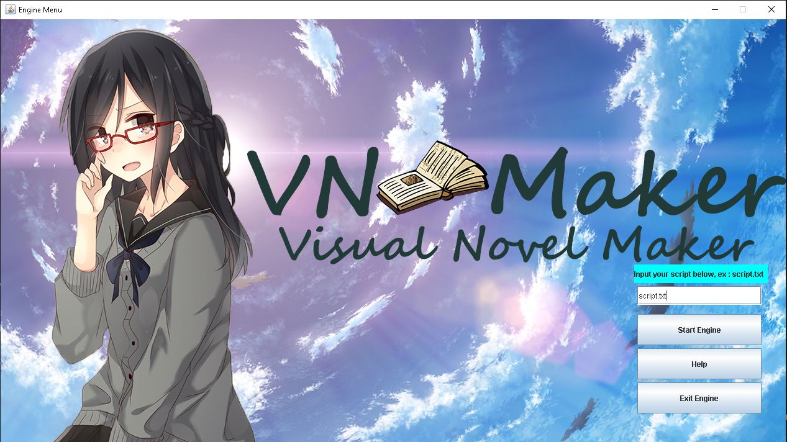
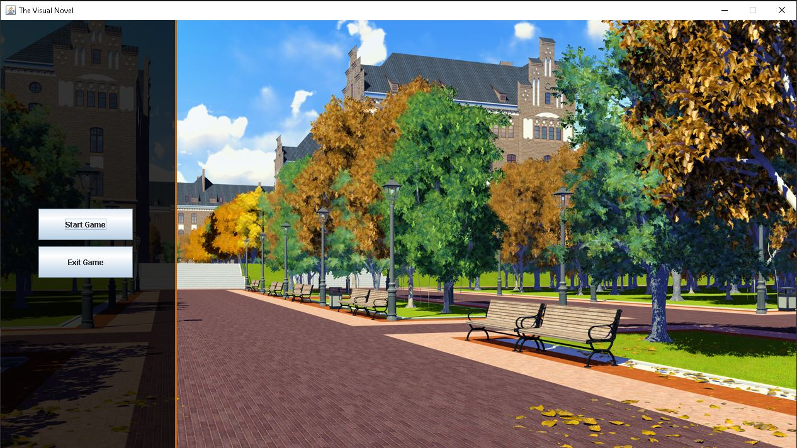
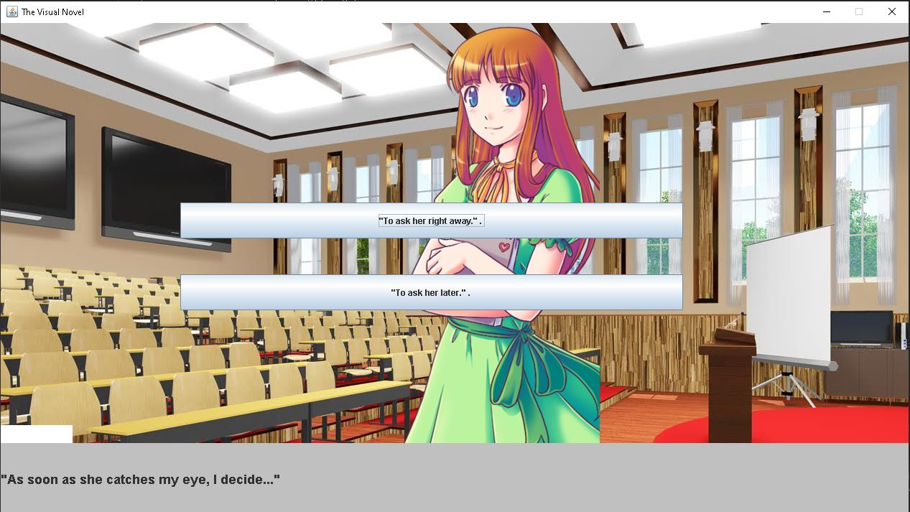

# Visual-Novel-Engine
A project done for Java Course

An engine to make a visual novel using predetermined images and writing format made using Java. User only have to make script using the format.

